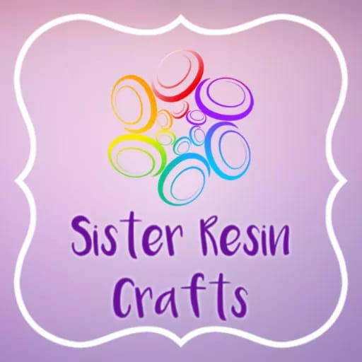

<h1 align="center">Sister Resin Craft</h1>

[View live project](https://mcnic16.github.io/sisterresincraft-repo/shop.html)


This is the Website for Sister Resin Crafts. It is designed to be responsive and accessible on a range of devices, making it easy to navigate for potential customers with potential developments to be added in the future.
Currently all items on the site are linked to an Etsy shop. Items cannot be purchased through the website but this development will be added at a later date.
On the Home page there is a featured items list, which will be updated to show all the new items available. On the About page a form has been included for customer queries and requests. Future development of this feature will include customers being able to review the website and items purchased.


<h2 align="center"></h2> 

<h2 align="center"></h2>
<h2 align="center"></h2>
<h2 align="center"></h2>
<h2 align="center"></h2>


## User Experience

 ### User stories

As I first time visitor I would like: 

1. To learn the background of the company.
2. For the site to be user friendly and easy to navigate.
3. Reviews and ratings from other customers to be easy to locate.
4. Learn any further information through the company's social media platforms.

As a returning customer I would like:

1. To see the website has been updated and what new items are available.
2. To easily find any promotional offers available including sales.
3. To be able to contact company directly with any queries or customer orders.

 ## Design

- The main colour scheme of the website is purple ombre and white. 

## Typography

- Sister Resin Crafts title was done using a Dancing Script font. The rest of the site was done using the roboto font.

## Technologies Used

Languages:

- HTML 5 and CSS

 ## Frameworks, Libraries & Programs Used

- [Bootstrap 4.1.3:](https://getbootstrap.com/docs/4.1/getting-started/introduction/)

Bootstrap was used to assist with the responsiveness with the website.

- [Font Awesome](https://fonts.google.com/)

 Font Awesome was used on all pages throughout the website 

 - [Git](https://git-scm.com/)

Git was used for the Gitpod terminal to commit to Git and Push to GitHub.
 
 - [GitHub:](https://github.com/)

 GitHub is used to store the projects code after being pushed from Git.

 ## Testing

-  The W3C Markup Validator and W3C CSS Validator Services were used to validate every page of the project to ensure there were no syntax errors in the project.

-   [W3C Markup Validator](https://jigsaw.w3.org/css-validator/#validate_by_input) 
-   [W3C CSS Validator](https://jigsaw.w3.org/css-validator/#validate_by_input)
Results can be seen through the Git commits.

 ## Testing User Stories from User Experience  Section

 - As I first time visitor I would like: 

1. To learn the background of the company

The about page of the website includes an about us section and details of the business policies of the business.

2. For the site to be user friendly and easy to navigate.

The navigation bar is located at the top of the site and is on every page and the menu options can be found in the left hand corner. The menu is clear and concise in order to aid users to circumnavigate the website with ease.
Under the navigation bar is the company name and logo wih featured items underneath.
These items will be updated periodically with new product. All social media platforms have been linked to the site through the icons in the footer.
All items for sale have been linked to the company's etsy shop to enable customers to purchase desired items. All links open up in a new tab when seperated.


3. Reviews and ratings from other customers to be easy to locate.

A link to the company's Etsy reviews is included in the about page. A separate Customer Review page will be added in the future.


4. Learn any further information through the company's social media platforms

The Company social platforms are Facebook and Instagram and the links can be located in the footer. The company has also recently joined TikTok and this will be added to the website in future.

As a returning customer I would like:

1. I would like to see the website has been updated and what new items are available.

All new items will be placed on the Home page. In future a date of the site's last update will appear in the footer.

2. To easily find any promotional offers available including sales.

All promotional offers will be placed on the Home page, and that will include sales. A visitor counter will be added as the site development progresses.


3. To be able to contact company directly with any queries or customer orders.

At the moment all correspondance would be through the Etsy shop but in the future, orders will be made through the website with a new page for customer's to review their purchases. A seasonal page  i.e. a Christmas page for relevant items will also be added in the future.

### Further Testing

- The Website was tested on Google Chrome, Internet Explorer, Microsoft Edge and Firefox browsers.
-   The website was viewed on a variety of devices such as Desktop, Laptop, Tablet and              mobile.
-   A large amount of testing was done to ensure that all pages were linking correctly.

### Known Bugs

- on mobile devices the pictures are to close to together on the index page.

## Deployment

- The project was deployed to GitHub Pages using the following steps...

1. Log in to GitHub and locate the [GitHub Repository](https://github.com/)
2. At the top of the Repository (not top of page), locate the "Settings" Button on the menu.
    - Alternatively Click [Here](https://raw.githubusercontent.com/) for a GIF demonstrating the process starting from Step 2.
3. Scroll down the Settings page until you locate the "GitHub Pages" Section.
4. Under "Source", click the dropdown called "None" and select "Master Branch".
5. The page will automatically refresh.
6. Scroll back down through the page to locate the now published site [link](https://github.com) in the "GitHub Pages" section.

### Forking the GitHub Repository

- By forking the GitHub Repository we make a copy of the original repository on our GitHub account to view and/or make changes without affecting the original repository by using the following steps...

1. Log in to GitHub and locate the [GitHub Repository](https://github.com/)
2. At the top of the Repository (not top of page) just above the "Settings" Button on the menu, locate the "Fork" Button.
3. You should now have a copy of the original repository in your GitHub account.

### Making a Local Clone

1. Log in to GitHub and locate the [GitHub Repository](https://github.com/)
2. Under the repository name, click "Clone or download".
3. To clone the repository using HTTPS, under "Clone with HTTPS", copy the link.
4. Open Git Bash
5. Change the current working directory to the location where you want the cloned directory to be made.
6. Type `git clone`, and then paste the URL you copied in Step 3.

```
$ git clone https://github.com/YOUR-USERNAME/YOUR-REPOSITORY
```

7. Press Enter. Your local clone will be created.

```
$ git clone https://github.com/YOUR-USERNAME/YOUR-REPOSITORY
> Cloning into `CI-Clone`...
> remote: Counting objects: 10, done.
> remote: Compressing objects: 100% (8/8), done.
> remove: Total 10 (delta 1), reused 10 (delta 1)
> Unpacking objects: 100% (10/10), done.
```

Click [Here](https://help.github.com/en/github/creating-cloning-and-archiving-repositories/cloning-a-repository#cloning-a-repository-to-github-desktop) to retrieve pictures for some of the buttons and more detailed explanations of the above process.

## Credits

To help me with my form on the About page I used [reusableforms](http://reusableforms.com/d/e1/bootstrap-contact-form-send-email)

### Acknowledgements

-   My Mentor for continuous helpful feedback.

-   Tutor support at Code Institute for their support.

 

 


